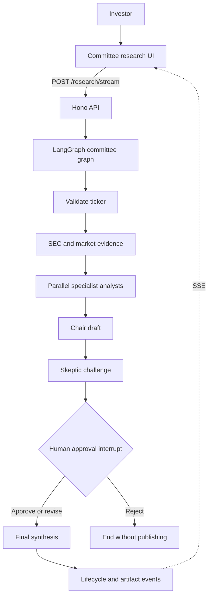
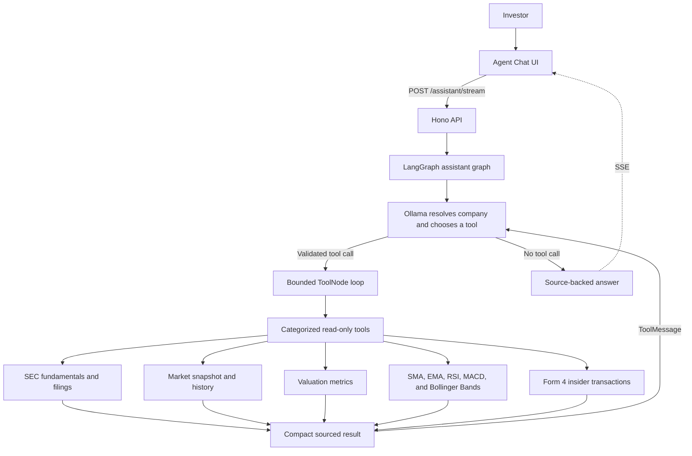

# AlphaVerifier

A source-backed equity research workspace that helps investors test a thesis against financial,
market, technical, and ownership evidence. Built with React, Vite, Hono, LangGraph.js, and Zod.

## Current milestone

The application now demonstrates two complementary LangGraph patterns.

### Committee research

- Run a predictable, source-backed workflow from a U.S. ticker.
- Retrieve SEC EDGAR fundamentals and Massive market context.
- Fan out to fundamentals, business-quality, and valuation analysts before a chair synthesis.
- Challenge the draft with a skeptic and pause the graph for human approval, revision, or rejection.
- Stream every stage and completed artifact to the UI through Server-Sent Events.
- Present price history, analyst reports, source trails, and the approved final memo.

### Agent chat

- Ask natural-language company questions without choosing a ticker first.
- Let the model resolve the company and select from categorized, read-only research tools.
- Inspect live tool calls for SEC filings, fundamentals, market data, valuation, and technical indicators.
- Retrieve annual fundamentals or a quarterly SEC revenue trend through one model-selected tool.
- Filter recent Form 4 insider activity by transaction, ownership, role, and Rule 10b5-1 context.
- Support SMA, EMA, RSI, MACD, and Bollinger Bands through deterministic close-only calculations.
- Stream tool activity, sourced results, and the final conversational answer to the UI.

Committee mode has deterministic fallbacks when Ollama is unavailable. Agent Chat intentionally
requires a tool-calling model so its model-directed behavior remains explicit.

## Architecture

### Committee research workflow



### Agent chat workflow



See the [architecture guide](docs/ARCHITECTURE.md) for design notes and key technical decisions.

## Prerequisites

- Node.js 22 or later
- pnpm 10 or later

## Run locally

```bash
pnpm install
pnpm dev
```

Open `http://localhost:5173`. The API runs at `http://localhost:8787`.

The root `.env` contains local API and Vite configuration and is ignored by Git. Copy `.env.example` when configuring a new environment; keep the real Massive key in this root file only.

In development, the UI includes a SEC source toggle. Choose the AAPL fixture for fast
iteration or Live SEC for a real request. Production builds expose only the live mode.

## Checks

```bash
pnpm check
pnpm build
```

## Formatting

```bash
pnpm format        # Format all supported files
pnpm format:check  # Verify formatting without changing files
```

## Documentation

- [Project plan](docs/PROJECT_PLAN.md)
- [Technical decisions](docs/TECHNICAL_DECISIONS.md)
- [UI decisions](docs/UI_DECISIONS.md)
- [Streaming design](docs/STREAMING.md)
- [Human approval interrupts](docs/HUMAN_APPROVAL.md)
- [Conversational tool-calling agent](docs/TOOL_CALLING_AGENT.md)
- [Technical analysis tools](docs/TECHNICAL_ANALYSIS.md)
- [Insider transactions tool](docs/INSIDER_TRANSACTIONS.md)
- [Rich assistant content](docs/RICH_ASSISTANT_CONTENT.md)
- [Product prompt guide](docs/DEMO_PROMPTS.md)
- [Market-data provider](docs/MARKET_DATA_PROVIDER.md)
- [Testing strategy](docs/TESTING.md)
- [System architecture](docs/ARCHITECTURE.md)
