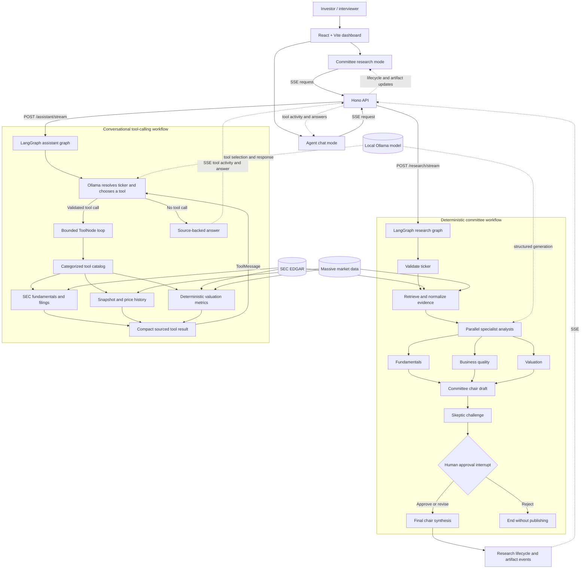

# Investment Research Committee

A source-backed, educational equity-research workflow built with React, Vite, Hono, LangGraph.js, and Zod.

## Current milestone

The project provides a complete multi-agent research demo:

1. Enter a U.S. ticker in the React dashboard.
2. Stream LangGraph node progress through the Hono API with Server-Sent Events.
3. Retrieve SEC EDGAR fundamentals and Massive end-of-day market context.
4. Run fundamentals, business quality, and valuation analysts with a chair draft and skeptic challenge.
5. Pause after the skeptic challenge for a human approve, revise, or reject decision.
6. Display a historical price chart, analyst reports, source trail, and approved final memo.
7. Ask naturally in a dedicated agent-chat mode where the model resolves the ticker and selects SEC, market, or valuation tools.

Local Ollama generation is optional; deterministic fallbacks keep the workflow usable when the model is unavailable.

## Architecture



See [Interview Demo Architecture](docs/ARCHITECTURE.md) for the accompanying design notes and interview talking points.

## Prerequisites

- Node.js 22 or later
- pnpm 10 or later

## Run locally

```bash
pnpm install
pnpm dev
```

Open `http://localhost:5173`. The API runs at `http://localhost:8787`.

The root `.env` contains local API and Vite configuration and is ignored by Git. Copy `.env.example` when configuring a new environment; keep the real Massive key in this root file only.

In development, the UI includes a SEC source toggle. Choose the AAPL fixture for fast
iteration or Live SEC for a real request. Production builds expose only the live mode.

## Checks

```bash
pnpm check
pnpm build
```

## Formatting

```bash
pnpm format        # Format all supported files
pnpm format:check  # Verify formatting without changing files
```

## Documentation

- [Project plan](docs/PROJECT_PLAN.md)
- [Technical decisions](docs/TECHNICAL_DECISIONS.md)
- [UI decisions](docs/UI_DECISIONS.md)
- [Streaming design](docs/STREAMING.md)
- [Human approval interrupts](docs/HUMAN_APPROVAL.md)
- [Conversational tool-calling agent](docs/TOOL_CALLING_AGENT.md)
- [Market-data provider](docs/MARKET_DATA_PROVIDER.md)
- [Testing strategy](docs/TESTING.md)
- [Interview architecture](docs/ARCHITECTURE.md)
