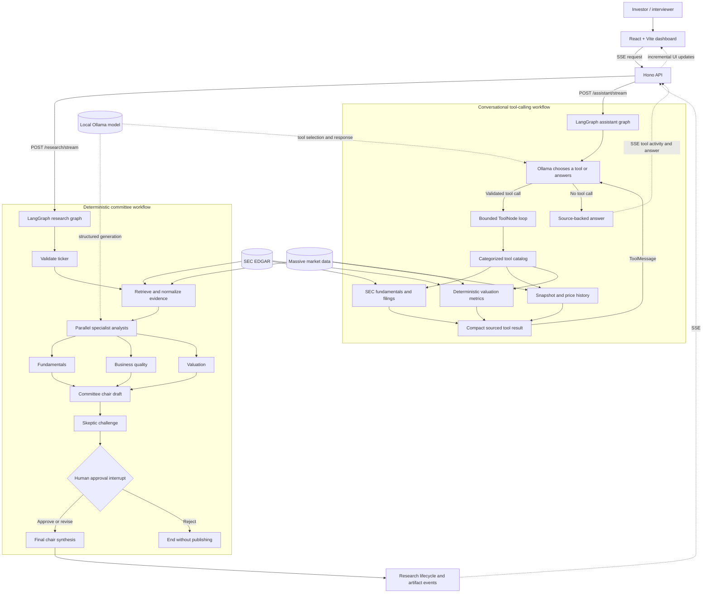

# Interview Demo Architecture

This diagram shows the two complementary LangGraph workflows behind the dashboard: a predictable
investment committee and a conversational agent that selects read-only research tools.

## Demo talking points

- The browser owns interaction and presentation; it does not orchestrate agents.
- Hono keeps provider credentials server-side and exposes streaming endpoints for both workflows.
- LangGraph owns shared state, ordering, parallel analyst work, critique, checkpointing, and
  conditional routing after a human decision.
- A separate bounded agent loop chooses read-only tools for focused user questions while the
  committee graph remains deterministic.
- The streaming workflow pauses at a graph boundary. The browser resumes the same run by its
  `thread_id`; it does not restart research or recreate graph state.
- SEC EDGAR provides filing evidence and Massive provides normalized market context.
- Ollama is replaceable because model invocation is isolated behind typed graph dependencies.
- Deterministic fallbacks keep the demo inspectable when a local model or provider is unavailable.
