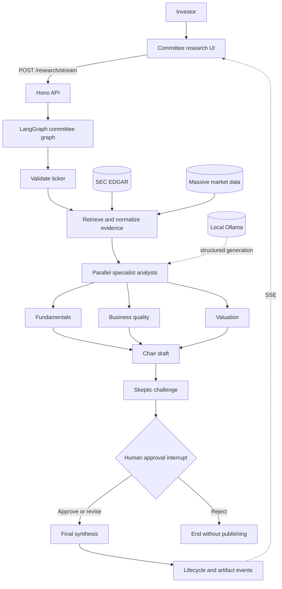
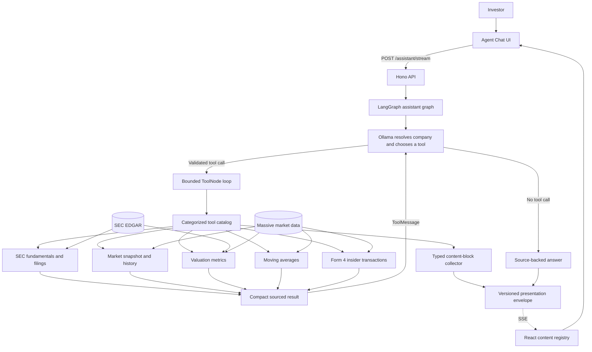

# System Architecture

The dashboard exposes two complementary LangGraph architectures. They share the React, Hono,
Ollama, SEC, Massive, and SSE boundaries, but they solve different interaction problems and are
therefore documented separately.

## Committee research workflow

This graph favors predictable orchestration, progressive artifacts, and a human decision before
publication.

## Agent chat workflow

This graph favors model-directed tool selection for focused questions while keeping the available
actions validated, read-only, and bounded.

## Demo talking points

- The browser owns interaction and presentation; it does not orchestrate agents.
- Hono keeps provider credentials server-side and exposes streaming endpoints for both workflows.
- LangGraph owns shared state, ordering, parallel analyst work, critique, checkpointing, and
  conditional routing after a human decision.
- A separate bounded agent loop chooses read-only tools for focused user questions while the
  committee graph remains deterministic.
- Rich tool data takes a typed presentation side channel to React, so charts and tables do not
  consume Ollama's limited context window. The model receives only compact tool summaries.
- The streaming workflow pauses at a graph boundary. The browser resumes the same run by its
  `thread_id`; it does not restart research or recreate graph state.
- SEC EDGAR provides filing evidence; Massive provides normalized market and Form 4 ownership
  context with direct links back to the original SEC filings.
- Ollama is replaceable because model invocation is isolated behind typed graph dependencies.
- Deterministic fallbacks keep the demo inspectable when a local model or provider is unavailable.
